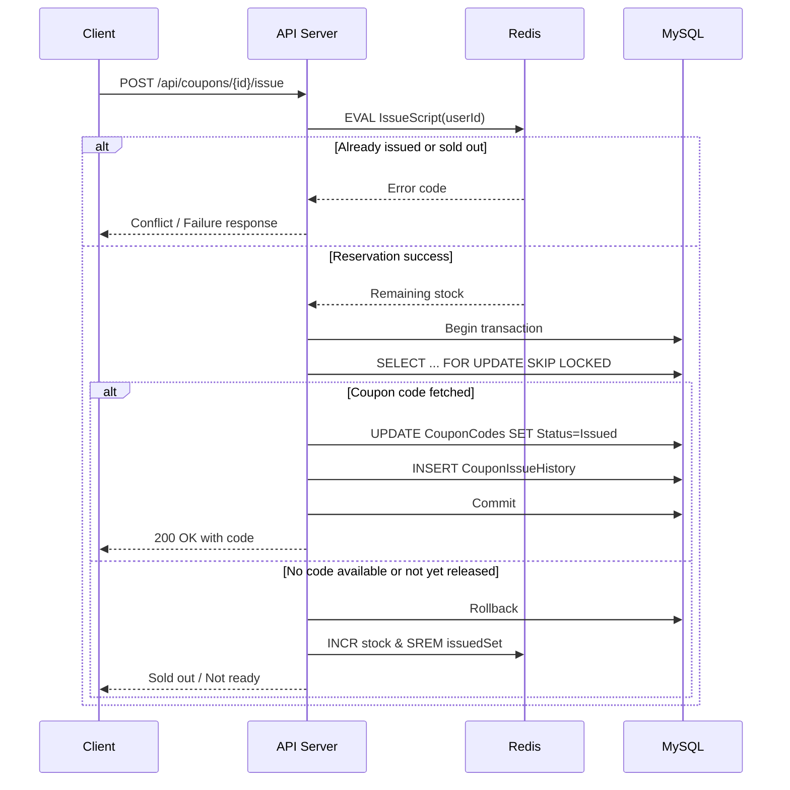

```mermaid
sequenceDiagram
    participant Client
    participant Api as API Server
    participant Redis
    participant MySQL

    Client->>Api: POST /api/coupons/{id}/issue
    Api->>Redis: EVAL IssueScript(userId)
    alt Already issued or sold out
        Redis-->>Api: Error code
        Api-->>Client: Conflict / Failure response
    else Reservation success
        Redis-->>Api: Remaining stock
        Api->>MySQL: Begin transaction
        Api->>MySQL: SELECT ... FOR UPDATE SKIP LOCKED
        alt Coupon code fetched
            Api->>MySQL: UPDATE CouponCodes SET Status=Issued
            Api->>MySQL: INSERT CouponIssueHistory
            Api->>MySQL: Commit
            Api-->>Client: 200 OK with code
        else No code available or not yet released
            Api->>MySQL: Rollback
            Api->>Redis: INCR stock & SREM issuedSet
            Api-->>Client: Sold out / Not ready
        end
    end
```

